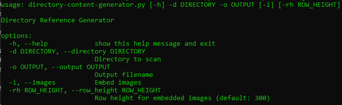
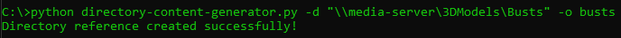
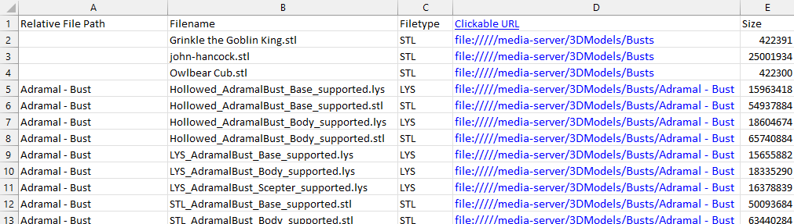
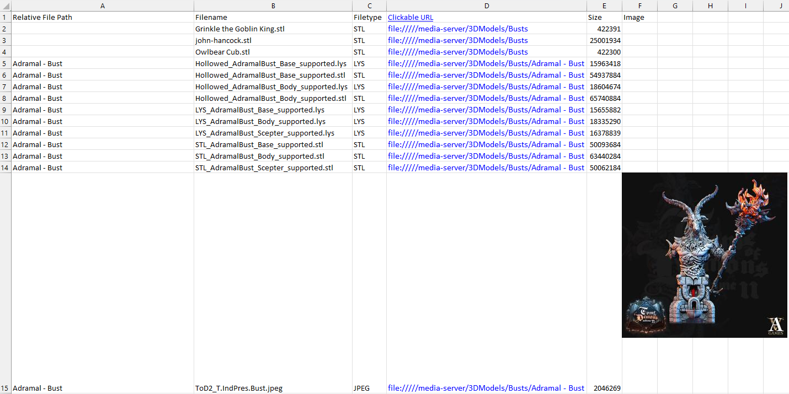

# Directory Content Generator

Are you tired of waiting on Windows search function to find files in subdirectories? 

I created this script so I had a quick reference for my 3D model STLs, then modified it to be a generic file info scraper. It creates an XLSX file containing information about all the files in the specified directory and subdirectories.

## Usage

Pass it a directory to scan and an output filename:

The following information will be scraped and stored in a spreadsheet:

- Relative file path
- Filename
- Filetype
- Clickable URL
- Size

You can optionally pass the `-i` or `--images` flag to also embed all images into the spreadsheet:

Aditionally, you can change the size of the images stored in the spreadsheet with -rh or --row_height (Default 300)